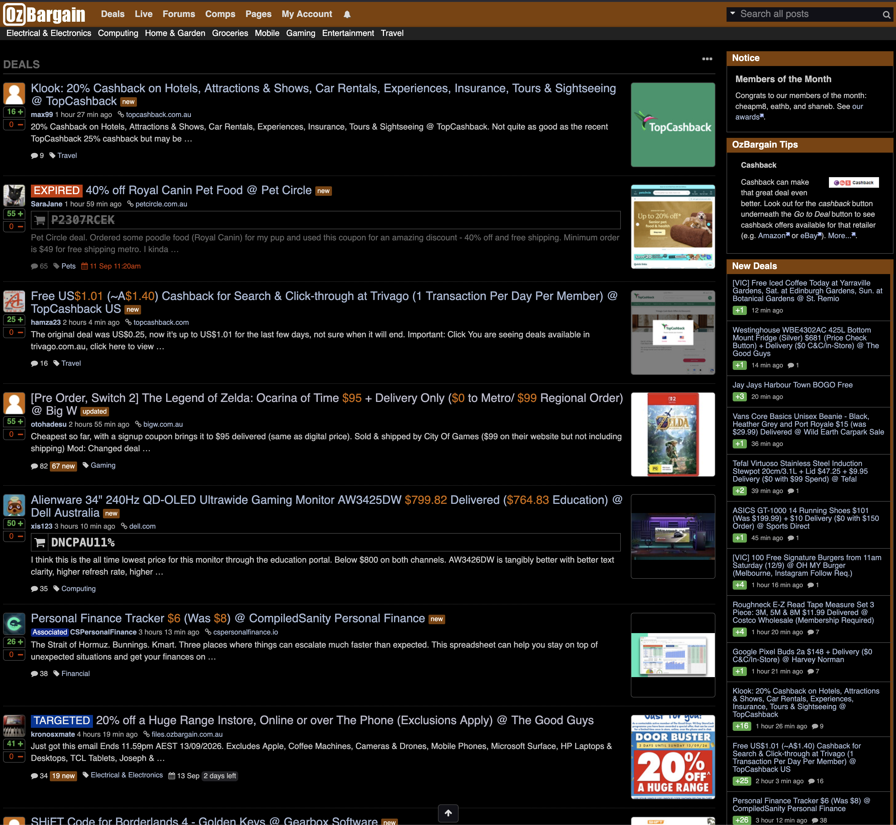
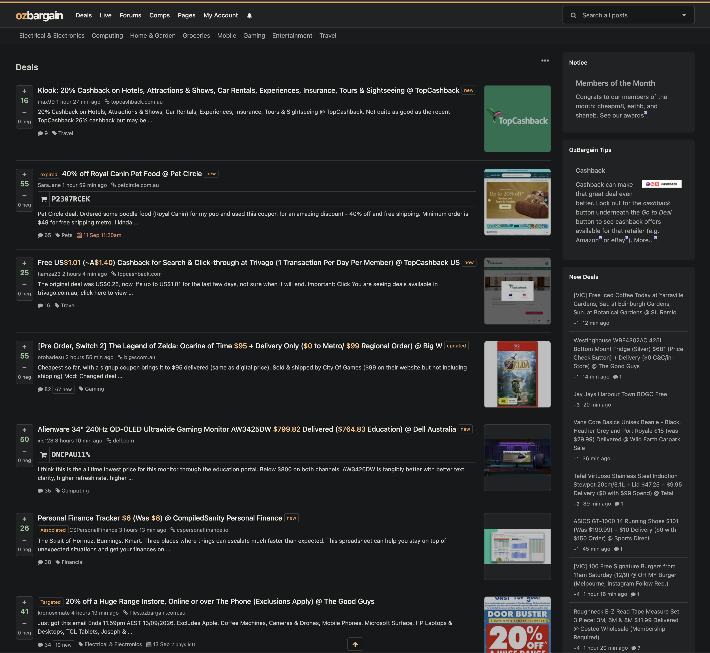

# Dark Bargain

**Same bargains. Easier on the eyes.**

A calmer dark theme for [OzBargain](https://www.ozbargain.com.au/), built for
Firefox. Warm charcoal, a little orange, and room to breathe—while keeping the
dense deal feed and community features that make OzBargain useful.

## Before & after

| OzBargain dark mode | Dark Bargain |
| --- | --- |
|  |  |

Click either screenshot to view it at full size.

## A little less noise

- **A cleaner feed.** Compact vote controls, consistent typography and subtle
  badges make deals easier to scan.
- **Deal pages with everything in reach.** Product image, vendor, cashback and
  the original deal button share one sidebar panel.
- **Readable conversations.** Clear reply threads, understated OP badges and a
  more comfortable comment editor.
- **Less image glare.** Gentle brightness and contrast adjustments, with a small
  ◐ toggle to show the original. Hover or keyboard focus also restores it.

Prices, conditions and community contributions stay where they belong: in the
original content. Links, voting, comments and menus retain their existing controls.

## Try it in Firefox

1. Download or clone this repository. If you download a ZIP, extract it first.
2. Open `about:debugging#/runtime/this-firefox` in Firefox.
3. Choose **Load Temporary Add-on…** and select [`manifest.json`](./manifest.json).
4. Open or refresh OzBargain.

This is a temporary installation: Firefox removes it when the browser restarts.
After updating the files, click **Reload** beside Dark Bargain in `about:debugging`,
then refresh your OzBargain tabs.

## Small by design

A stylesheet and two small content scripts. No build step, tracking, external
fonts or image-processing service. The extension runs only on OzBargain and
requests no additional host permissions. Image adjustments are CSS-only;
blurred images are left alone.

Want to tweak it? Colours, typography and image brightness are defined together
at the top of [`dark-bargain.css`](./dark-bargain.css).

## Feedback

Found an awkward corner? [Open an issue](https://github.com/sp4rks/dark-bargain/issues)
with the page URL and a screenshot. OzBargain has plenty of different page layouts,
and this is still a work in progress.

Independent project; not affiliated with OzBargain. Licensed under [MIT](./LICENSE).
